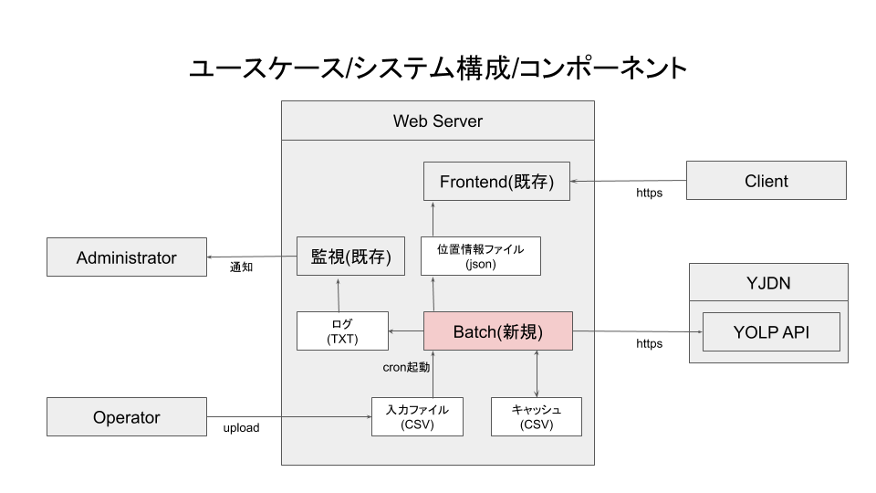

# csv2geo

### 目次
[このプログラムについて](#mokuji001)  
[動作環境](#mokuji101)  
[想定しているシステム構成](#mokuji201)  

## このプログラムについて
CSVで与えられた住所一覧に、緯度経度を付与したjsonファイルを生成します。

## ライセンスについて
このプログラムはMITライセンスにて公開しています。

## 動作環境
php (5系,7系)

## 想定しているシステム構成

## 事前準備
このプログラムは住所からの緯度経度変換にYahoo! Japan提供のYOLP APIを利用しています。  
プログラムからこのAPIを使用するためには、事前にYJDNに登録してAPPID(CLIENTID)を取得しておく必要がああります。  

## セットアップ方法
1.PHP動作環境の用意  
2.バッチプログラムの用意  
3.定数の編集  
3-1 APPIDの編集  
3-2 logfilenameの編集
4.動作確認
