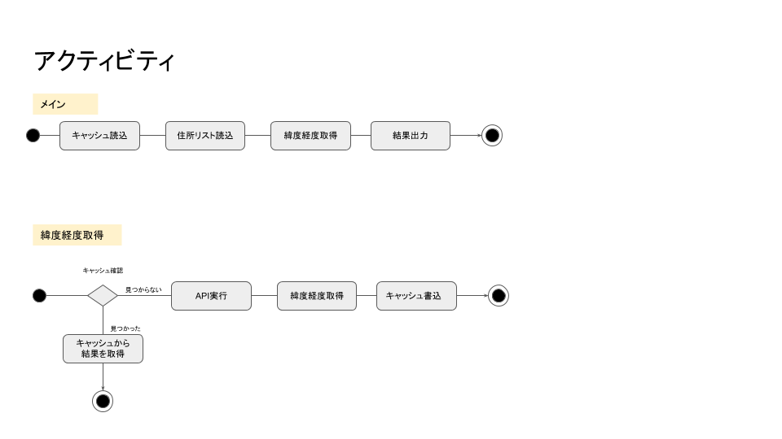

# geoget.php の詳細仕様
### 目次
[外部API](#mokuji101)  
[PHPのバージョンと外部ライブラリ](#mokuji102)  
[関連ファイル](#mokuji103)  
[関数概要](#mokuji201)  
　[メイン関数](#mokuji202)  
　[getCoordinates($addressString)](#mokuji203)  
　[getAPICache()](#mokuji204)  
　[putAPICache($key, $value)](#mokuji205)  
　[logPrint($logMessage, $logLevel)](#mokuji206)  
　[ログレベルと使用方法](#mokuji207)  
[アクティビティ図](#mokuji301)  
[エラーメッセージ一覧](#mokuji401)  

<a id="mokuji101"></a>
### 外部API
住所から緯度経度を取得するにあたって、以下のAPIを使用しています。
https://developer.yahoo.co.jp/webapi/map/openlocalplatform/v1/geocoder.html  

<a id="mokuji102"></a>
### PHPのバージョンと外部ライブラリ
```
$ php -v
PHP 7.0.33-0ubuntu0.16.04.5 (cli) ( NTS )
Copyright (c) 1997-2017 The PHP Group
Zend Engine v3.0.0, Copyright (c) 1998-2017 Zend Technologies
    with Zend OPcache v7.0.33-0ubuntu0.16.04.5, Copyright (c) 1999-2017, by Zend Technologies
```
開発はPHP7で行いましたが、最近実装された機能は使っていないのでPHP5でも動作すると思います。  
また、標準でインストールされる意外のライブラリは使用していません。  

<a id="mokuji103"></a>
### 関連ファイル
| 名称 | デフォルト名 | 機能　| 
|:----|:----|:----|
| 住所リストファイル   | コマンドライン引数で指定 | CSV形式の住所一覧 | 
| 結果出力ファイル     | コマンドライン引数で指定 | geojson形式の住所一覧 | 
| キャッシュファイル   | geoget-cache.txt | 以前APIで取得した緯度経度、CSV形式 |
| ログファイル        | geoget-log.txt | プログラム実行時に吐かれるログ、TXT形式 |

<a id="mokuji201"></a>
### 関数概要
--- 
<a id="mokuji202"></a>
#### メイン関数
##### 機能
プログラム全体のメイン処理となります。
##### 引数
| 引数 | 機能　| 
|:----|:----|
| argv[1] | 入力ファイル名  |
| argv[2] | 出力ファイル名  |
##### 戻り値  
正常終了した場合はshellに0を、異常終了の場合は-1を返します。    

---
<a id="mokuji203"></a>
#### getCoordinates($addressString)
##### 機能
住所から緯度経度を得ます。  
curl を使って、YOLP から $addressString で指定された住所の緯度経度を返します。
##### 引数
$addressString → 緯度経度の欲しい住所
##### 戻り値
緯度,経度の文字列を返します。  
例:
```
"140.87131347,38.26469260"
```

---
<a id="mokuji204"></a>
#### getAPICache()
##### 機能
APIキャッシュファイルを連想配列として読み込みます。
##### 引数
なし
##### 戻り値  
なし  

---
<a id="mokuji205"></a>
#### putAPICache($key, $value)
##### 機能
APIの結果をキャッシュファイルに追加します。
##### 引数
$key → 住所文字列
$value → 緯度経度文字列

##### 戻り値  
なし  

---
<a id="mokuji206"></a>
#### logPrint($logMessage, $logLevel)
##### 機能
ログを1行書き出します。
##### 引数
$logMessage → ログに書き込む文言
$logLevel → ログレベル

##### 戻り値  
なし  

<a id="mokuji207"></a>
#### ログレベルと使用方法
| 定数 | 内容 |
|:---|:---|
| NOLOG            | エラー出力しない |
| LOGLEVELERROR    | 致命的なエラー |
| LOGLEVELWARNING  | 継続可能なエラー |
| LOGLEVELINFO     | 情報表示 |
| LOGLEVELDEBUG    | 開発者用表示 |

実際のログファイルへの書き込みは、 $displayLogLevel に、ログレベルを指定する事で制御します。

--- 
<a id="mokuji301"></a>
### アクティビティ図


<a id="mokuji401"></a>
### エラーメッセージ一覧
| エラー表示 | エラーレベル | エラー詳細 |
|:---|:---|:---|
| 引数エラー Usage: $argv[0] 入力ファイル名 出力ファイル名 | LOGLEVELERROR |  | 
| 入力ファイル名と出力ファイル名は別でなければなりません。   | LOGLEVELERROR |  | 
| CSVファイルの読み込みに失敗しました。 [ファイル名]        | LOGLEVELERROR |  | 
| 結果ファイルの作成に失敗しました。 [ファイル名]           | LOGLEVELERROR |  | 
| 結果の書きこみに失敗しました。 [ファイル名]               | LOGLEVELERROR |  | 
| Curl error: ' . curl_error($ch)                       | LOGLEVELERROR |  | 
| API get failed. maybe Paramater.                      | LOGLEVELERROR |  | 
| CSVファイル中に欠損レコードです。 行番号: [行番号]        | LOGLEVELWARNING |  | 
| 該当する緯度経度が見つかりませんでした。 [住所]           | LOGLEVELWARNING |  | 
| API Cacheファイルの読み込みに失敗しました。 [ファイル名]  | LOGLEVELWARNING |  | 
| API Cacheファイル中に欠損レコードです。 行番号:  [行番号] | LOGLEVELWARNING |  | 
      
